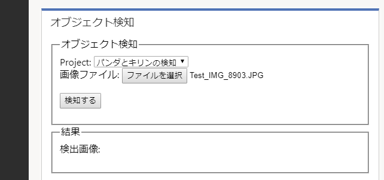

# D365CE-CustomVisionObjectDetection
D365 CE と Custom Vision Object Detection (執筆時点でプレビュー) の API を使ったサンプルです。  
D365 CE と Custom Vision Object Detection と Azure Functions を利用しています。

## 前提条件
- Custom Vision の Object Detection で Training が済んでいる Project をお持ちであること。
    * 注意：Custom Vision Object Detection は2018年8月9日時点でプレビュー機能です。
- Azure 環境をお持ちであること
- D365 CE 環境ををお持ちであること
    * D365 CE v9.0.2 の環境で開発しています。

## 動作の流れ
1. D365 CE の Web リソースが画像を取得し、必要に応じて圧縮し、Azure Functions の関数に渡す。
1. Azure Functions の関数は、Custom Vision Object Detection の API を呼び出し、検知した情報を取得。その情報に応じて検知された内容が内部に記載された画像を生成し、返す。
1. D365 CE の Web リソースが Azure Functions の関数から検知された内容が内部に記載された画像を受け取り、フォーム上に表示。同時に2つのメモレコードを作成する。

## サンプル展開手順
1. Custom Vision Object Detection の設定
    1. Training が済んでいる Project の画面に行き、Performance をクリック
    1. Prediction URL をクリック
    1. "If you have an image file:" の方に表示された URL などの情報をメモしておく（※1）
1. Azure Functions の設定
    1. VS で Azure Functions プロジェクトを新規に作成
    1. そのプロジェクトに NuGet パッケージを適用
    1. 新規の関数を作成し、[このフォルダ](AzureFunctions) にある「CVODFunction1.cs」を、※1の内容を基に、projectId、iterationId、predictionKey を適宜修正
    1. Azure に発行
    1. Azure ポータル上で、その Function App における「プラットフォーム機能」内の CORS 設定で D365 CE インスタンスの URL を指定
    1. Azure ポータル上で、その Function App 内の CVODFunction1 に遷移し、「</> 関数の URL の取得」をクリックして、URL をコピーしておく（※2）
1. D365 CE の Web リソースの設定
    1. [このフォルダ](D365CE_Solution) にある IncidentObjectDetection_1_0_0_0_p.zip あるいは IncidentObjectDetection_1_0_0_0_managed_p.zip  を D365 CE インスタンスにインポート
        - このソリューションは、専用の1つのアプリを追加するものです。なお、サポート案件 エンティティを使用し、フォームを追加しているがフィールドは追加していません。
    1. main.js を編集する。内の Detector.AzureFunctionUri の値として、上記※2の値を貼り付けます。
    1. すべてのカスタマイズを公開します。

## サンプル利用手順
1. D365 CE の「サポート案件オブジェクト検知」アプリ（Unified Interface）をオープンします。PC からでもモバイル アプリからでも利用できます。
1. 既存の（新規ではない）サポート案件レコードを開きます。
1. サポート案件フォーム「オブジェクト検知」が表示されていることを確認します。
    - なお、必要に応じてソリューションファイル内の html ファイルを編集して「パンダとキリンの検知」のような文字列は適宜ご自身の Custom Vision の Project の内容に応じて修正ください。なおこのサンプルでは、この select 要素のメニューはプログラムのロジックには何も影響を与えていないものです。
    - 
1. フォーム上左側の「オブジェクト検知」Web リソース 表示エリア内で「ファイルを選択」をクリックし、既存の画像ファイルを選択するか、その場で写真を撮ってください。
    - 
    - 
1. 「検知する」ボタンをクリックください。
    - 
1. 検出された内容が内部に記載された画像が表示されます。
    - 
1. 同時に、このサポート案件レコードに紐づく2つのメモレコードが作成されています。（タイムラインの表示を最新のものに更新する必要があります。）
    - 1つは検出された内容が内部に記載された画像ファイルを持つメモレコード
    - もう1つは、オリジナルの画像ファイル（圧縮前）を持つメモレコード
    - 

## より現実的に使用するために考えられること
- このサンプルでは、Custom Vision Object Detection で検知した結果は画像ファイル内にのみ情報が存在しています。検知した結果をもとに何かしらの処理を D365 CE 上で自動化したいような場合には、検知結果は画像だけでなく、データとしても返すような仕組みが有効と考えられます。そのためには、Azure Functions 関数を修正する、また D365 CE 側の Web リソースがそれを扱えるように修正することが必要です。
